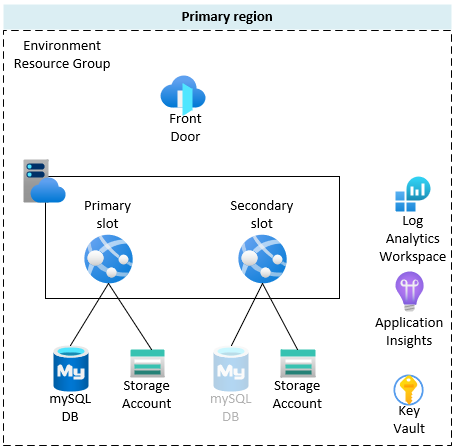

# Ghost on Azure

[Ghost](https://ghost.org/) deployment on [Azure Web App for Containers](https://azure.microsoft.com/en-us/services/app-service/containers/).

## Overview

This is an Azure Web app deployed as a container. It uses [the official Ghost Docker image version 4.29.0-alpine](https://hub.docker.com/_/ghost) and [Azure Database for MySQL](https://azure.microsoft.com/en-us/services/mysql/) to store the application data. Content is persistently stored in Azure Storage File Share.

## High level design

Bicep template deploys and configures the following Azure resources to a single region:

* Azure App Hosting plan with Azure Web app for running the Ghost image
* Azure App Service deployment slot if required
* Azure Key Vault for storing secrets such as database passwords
* Log Analytics workspace and Application Insights for monitoring
* Azure Database for MySQL server
* Azure Storage Account and File Share for persisting Ghost content
* Azure Front Door endpoint with a WAF policy for securing the traffic to the Web app

## Solution Requirements

### No downtime deployment

For the application layer, rolling deployment with no downtime can be performed by using the App Service deployment slot swap feature.
Further, database and content layers have the option to be replicated to pre-production (staging) for any testing before swapping the slots.

### Scalability

In terms of scale out, Ghost supports front end tier scaling, done by Azure Front Door which can auto scale and provide content caching.
Ghost application and data tiers do not support scaling out.

### Monitoring

All resources have their diagnostic settings configured to stream resource logs and metrics to the Log Analytics workspace.

### Business continuity

All services deployed in a single region are implicitly highly available and supported by Azure platform and are guaranteed by an SLA.

Ghost application doesn't support clustering of ghost web instances.

### Disaster recovery

In regards to disaster recovery, the solution design supports deployment of.

## Deployment

The solution is templated using Bicep.

The solution is deployed using Github workflow, but can also be manually deployed using Azure CLI or Powershell.

### Prerequisites

Following are the prerequisites that need to be met for the Github workflow:

* Resource groups - Resource groups for environments

* Service principals - Azure AD service principal, one for each environment

* Access - Service principal Contributor access to the respective environment resource group

* Actions secrets - secrets in the repository for authentication and authorizing Github workflow with Azure resource groups
