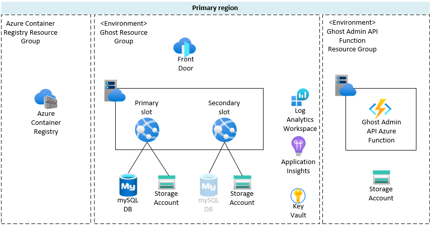

# Ghost on Azure

[Ghost](https://ghost.org/) deployment on [Azure Web App for Containers](https://azure.microsoft.com/en-us/services/app-service/containers/).

## Overview

This is an Azure Web app deployed as a container. It uses [the official Ghost Docker image version 4.29.0-alpine](https://hub.docker.com/_/ghost) and [Azure Database for MySQL](https://azure.microsoft.com/en-us/services/mysql/) to store the application data. Content is persistently stored in Azure Storage File Share.

## High level design

Bicep template deploys and configures the following Azure resources to a single region:

* Azure App Hosting plan with Azure Web app for running the Ghost docker image
  * Additional deployment slot if required
  * IP restriction - from Azure Front Door allowed only
* Azure Key Vault
  * Storing secrets such as database passwords and Azure AD principal secrets
* Log Analytics workspace and Application Insights for monitoring
* Azure Database for MySQL servers for each Web App slot
* Azure Storage Account and File Share for persisting Ghost content
* Azure Front Door Standard
  * Endpoints for each slot with caching enabled
  * WAF policy for securing the traffic to the Web app
* Azure Function App hosting the serverless function for Ghost posts deletion
  * Azure AD authentication enabled

## Solution Requirements

### No downtime deployment

For the application layer, rolling deployment with no downtime can be performed by using the App Service deployment slot swap feature.
Further, database and content layers have the option to be replicated to pre-production (staging) for any testing before swapping the slots.

### Scalability

In terms of scale out, Ghost supports front end tier scaling, done by Azure Front Door which can auto scale and provide content caching.
Ghost application and data tiers do not support scaling out.

### Monitoring

All resources have their diagnostic settings configured to stream resource logs and metrics to the Log Analytics workspace.

### Business continuity

All services deployed in a single region are implicitly highly available and supported by Azure platform and are guaranteed by an SLA.

Ghost application doesn't support clustering of ghost web instances.

### Disaster recovery

With regards to disaster recovery, elements of the solution support replication or failover to a paired region.
Storage account is geo-replicated, database replication can be enabled to a paired region, container image deployed to a paired region, and Front Door is a global service.

## Deployment

The solution is templated using Azure Bicep.

The solution is deployed using Github workflow, but can also be manually deployed using Azure CLI or Powershell.

Github workflow has a number of steps which lint and validate the bicep code before deploying the solution into the required environment.

After the deployment is complete, testing step is performed to validate the run state of both Ghost frontend endpoint and Function app endpoint.

Due to the nature of private Github repositories, workflow environment separation and workflow reuse features are not available. Therefore, deployment into higher level environments (staging/production) would be implemented by copy/pasting the development solution yml code, with a couple of parameter changes.

### Prerequisites

Following are the prerequisites that need to be met for the Github workflow:

* Existing Azure Container Registry
  * Ghost docker image imported

* Resource groups
  * For solution environment - parameter input
  * For function app - *rg-applicationNamePrefix-fa-environmentCode*

* Service principals for Github workflow deployment
  * Azure AD service principal, one for each environment

* Access
  * Service principal *Contributor* RBAC access to the respective environment resource group and function app resource groups - deploy solution via Github workflow
  * Service principal *Cloud application administrator* Azure AD role - deploy Azure AD application for Function App authentication

* Github Action secrets
  * Secrets in the repository for authentication and authorizing Github workflow with Azure resource groups

| Name | Description |
|---|---|
| AZURE_CREDENTIALS_DEV | Main credentials for worflow deployment to development resource groups |
| AZURE_CREDENTIALS_PRODUCTION | Main credentials for worflow deployment to production resource groups |
| DATABASEPASSWORD | MySQL database password |
| DEV_APP_PASSWORD | Azure AD Application Secret - used by the Function App External Authentication |
| DEV_SP_PASSWORD | Deployment Service principal secret - used by AAD App Deployment Script |

## Function App

To enable the on-demand deletion of all Ghost blog posts, Node.js Azure Function App is implemented which gets triggered via an HTTP request. When triggered, it deletes all Ghost posts using a call to Ghost Admin API endpoint.
The Function is deployed using the same Github workflow into a separate resource group(s).

Function App is enabled with Azure AD authentication.

### Function App Prerequisites

Ghost Admin API key needs to be generated manually in the Ghost admin portal and added as a *GhostAdminApiKey* application setting in the function app after the function deployment. *GhostAdminApiKey* has a placeholder value when initially deployed.

When setting is populated, Function can authenticate to the Ghost Admin API endpoint.
